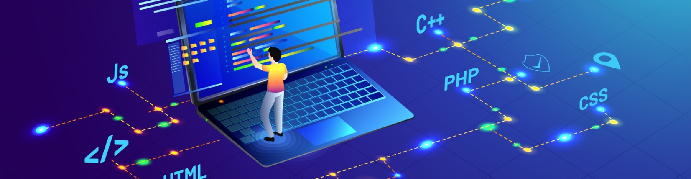

# My Beginnings

In my very first years of high school, I came across software engineering from my very first coding class. It was a really simple class, where we built websites, learned about the basics of CSS and JS, and had to create an interactive story on a website as our final project. I was hooked instantly. I loved how there were no boundaries and that with coding, the possibilities are just endless. I would spend hours awake past midnight perfecting my projects and researching ways to improve the clarity and structure of my code. This prompted me to take up a Computer Science major, and I've been enjoying the classes ever since.

# Building my Interests

Now that I have some coding experience as a sophomore in college, I've started to pick up a few particular interests in software engineering.

One of my projects, a Discord bot, really opened up my eyes to the side of database management. It's weird how something as simple as a database could seem interesting, but I just find it fascinating how data storage and retrieval works. Using APIs to request data and parsing that data to a readable format is cool to me. For example, in the game that I played, there are these profiles that can be customized. In these profiles, there's your username, your birthday, your unique ID, the characters you want to show off, and various other stats like your level and achievement count. By nature, these stats are only visible in the game and can't be seen elsewhere. However, some unofficial APIs can pull this information from the game to be displayed on websites and stat trackers. The flexibility and level of access that comes with these APIs are really interesting, and I like creating my own little web apps or bots that can display this information even if you're not playing the game.

# The Future

I know that I can't rely on the skills I have now to get a job, so I'll need to branch out and learn more. One of these skills I'd like to sharpen is back-end development. I want to be able to connect a front-end website with a back-end server that communicates with a database. This is essentially a full-stack application that I want to create. In the future, I would like to be able to be comfortable with these technologies and the various languages and frameworks that come with them.