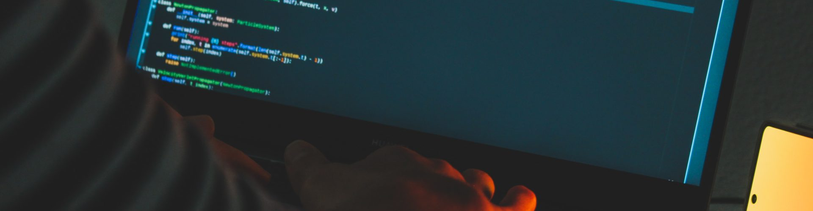

# Introduction

Throughout ICS314, I've learned a lot about web development and how to deploy a successful application. However, although I've acquired the skills to deploy a functional website, I also learned how to transfer these skills into the broad field of software development. In this essay, I'll be doing over three different skills I learned during my time developing my website, as well as discussing their importance and relevance beyond web applications.

# Coding Standards

Coding standards is a huge topic, but to narrow it down to one definition, it can be thought of as the set of guidelines and best practices that developers follow to write clean, readable, and maintainable code. The standards that are typically followed include things like naming conventions, formatting, documentation, and syntactic styling. The main goal of coding standards is to ensure that the code is consistent across a project or a team, which will in the end make it easier to understand and debug.

To illustrate the importance of coding standards, take a look at the following code snippet:

```
function calc(a,b){
if(a<b){return a-b;}else{return a+b;}
}
var x=5,y=3;
calc(x,y);
```

We can see here that the "calc" function has many problems. Besides looking messay, there are inconsistent indentations, missing spaces, unclear variable names, and lack of documentation. Let's try to clean it up a bit and see how it looks:

```
/* If the number a is less than b, the function will return the difference between the two. If the number a is greater than b, the function will return the sum of the two. */
function calculate(a, b) {
  if (a < b) {
    return a - b;
  } else {
    return a + b;
  }
}

const x = 5;
const y = 3;
calculate (x, y);
```

This version of the code looks much nicer, and has consistent spacing. Furthemore, the variable names make sense, and there is documentation to explain what the code does.

In ICS314, we adhered to coding standards by using tools like ESLint. ESLint was a helpful tool to help us maintain the same coding style across applications by pointing out inconsistencies. Coding standards are essential for collaboration because they reduce the cognitive load when multiple developers are working on the same project.

Beyond web application development, coding standards are crucial for any software project. For example, in a team working on a robotics project, adhering to coding standards ensures that each module integrates seamlessly and remains readable for future developers. Even in solo projects, following coding standards improves productivity by reducing errors and making the code easier to revisit.

# Development Environments

A development environment is simply a collection of tools/software that programmers use to write, test, and debug code. In our class, we used an integrated development environment (IDE) called VSCOde. This IDE is special, since it allows you to run code within the environment, as well as provide helpful extensions for the user to debug their code or adhere to a certain coding standard.

In our class, we used Node.js and npm to manage the dependencies in our projects and to run applications efficiently. In addition, VSCode provides built-in tools like syntax highlighting, version control, and debugging tools which helped us easily write our code. 

The importance of development environments extends to all areas of software engineering. For instance, in mobile app development, tools like Xcode provide the necessary simulators and debugging features to streamline testing on various devices. I remember using Xcode in the past to create a small iOS application. It was relatively straightforward and provided all the tools I needed. Similarly, in data science, environments like Jupyter Notebooks or VSCode configured with Python libraries enable smooth experimentation and analysis. We used VSCode with Python libraries in Discrete Math 1 to run simulations of the theories taught in class.

# Ethics in Software Engineering

Ethics in software engineering refers to the moral principles and responsibilities that guide developets into creating software that is fair, secure, and beneficial to society. Software engineers have to make sure that their code is safe, and to consider how their work will affect users, communities, and the environment. 

Recently, I read an ethical issue regarding the University of Minnesota and the Linux controversy. In short, the UNM intentionally submitted bad patches disguised as legitimate to see if the Linux kernel contributors would accept or reject them. This was an ethical issue, because it violated many ethical principles set by the computing industry. For example, when thinking about the public eye, the ACM code of standards states that software engineers should act consistently with the public interest. However, the developers at the UNM only focused on their experiment and its outcome for their paper. In addition, they didn't act in the best interest of the client and employer, since they jeopardized the Linux kernel and gave more work to the contributors (who work for free and volunteer time to the Linux repository).

The importance of ethics extends far beyond just web development and contributions to Linux. In artificial intelligence, ethical considerations are critical to prevent bias in machine learning models and ensure fairness. For example, a hiring algorithm must be designed to avoid discrimination based on gender, race, or other attributes. In cybersecurity, ethical behavior is essential to safeguard systems against malicious attacks while respecting privacy rights.

# Conclusion

This course has shown me that software engineering isn't just about web development, but that it's a discipline grounded in fundamental concepts. The concepts I covered in this essay are universally applicable in the field of software development, whether you're working on a website, a mobile application, a scientific project, or an AI system. By understanding and applying these concepts, I feel better prepared to approach any software development project with a thoughtful mindset. The skills and knowledge gained from this course will continue to serve as a strong foundation for my future endeavors in software engineering.