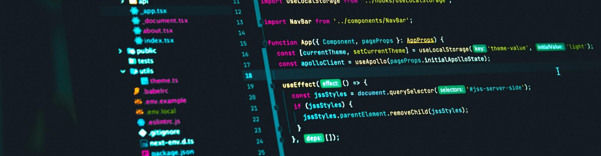

# Exploring Typescript

So far, Typescript has been an enjoyable language to learn. It combines the relative freedom that Javascript offers while adding in the strict typing of a language like C. It’s also shown quite a contrast to the other languages I learned throughout college, like Java and C/C++. In those languages, a large emphasis was placed on being verbose with your variables, having a proper “main” function, or requiring intricate syntax. Typescript throws most of those things out and rather relies on inferences to make the life of the programmer easier. However, it doesn’t make everything so simple when it comes to types. In essence, Typescript emphasizes the importance of labeling. Everything from what kind of value a variable holds, which elements can be in an array, and the return value of your functions, must be clearly defined. 

```javascript
function add(first, second) {
  return first + second;
}

function add(first: number, second: number): number {
  return first + second;
}
```
<sub>An example of the strict typing in Typescript</sub>

In my opinion, this is what makes it better than Javascript, and I feel like it’s a very good language for people who want to learn programming. Additionally, with its varied use in websites, it can be a very versatile language for people looking to get into web development.

# Coding Under Pressure 

The professor for my ICS314 class utilizes a special learning tool called WODs (workout of the day). In these WODs, we’re required to code a solution to a problem while working under a time limit. Personally, I enjoy these challenges a lot because they simulate what a real technical interview would be like. You have to think of a solution, write the code, and debug it, all while having a ticking clock above your head. Although stressful, once the perfect solution comes to mind, it’s great seeing the code form into place and the results print out exactly what you expected. The skills I get from these WODs over the course of the semester will hopefully push my brain to work better under pressure.

# Closing Thoughts

All in all, I think I’ll come to enjoy ICS314. Typescript has been a blast to learn, and I’m excited about the final project where I’ll be able to see all my efforts come to fruition. I’m hopeful that I’ll learn a lot, and that I’ll be confident when it comes to my future in software engineering.