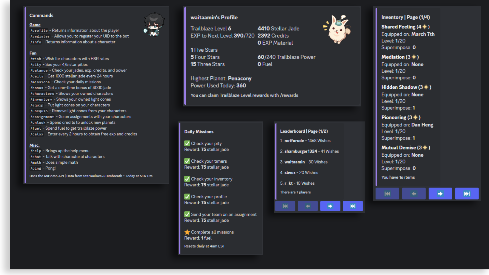

This sign-in webapp is a website that I am currently in the process of coding. It's a very simple website with two pages. The first is a typical sign-in form, while the second is a registration form. The intended purpose for this website is to act as a prototype for future projects that utilize login systems. Right now, there is both the front-end, which is what the user sees, and a back-end, which is what only I should be able to see. This login form should accept an email address and a password. Then, after accepting these two fields, it communicates with a back-end API that checks for the correctness of the two items. If the password is incorrect or the email hasn't been registered yet, an error is thrown to the front-end page telling the user to try again. This project combines multiple moving pieces together: a database that holds encrypted and salted personal information, a back-end to communicate with the database, and a front-end to communicate with the user and the back-end. Overall, this project helped me learn how to implement a very basic full-stack application.

For this project, I was the sole programmer, which required me to learn all the parts to a full-stack website. I started by creating the front-end page, which was just a simple HTML file with very minimal CSS styling. From there, I began to look for services to host my website. I was able to find Vercel, a cloud platform that's able to host hobby projects for free. After that, I started to work on an API. This API is sent requests from the front-end, and it must be able to communicate with the database whenever a user tries to login. Finally, I combined the front and back ends together to create a seamless website.

The main thing I learned from this project was sending requests with Javascript. In my front-end, whenever a user pressed the Submit button, the website had to send a POST request to the API with the correct headers. This request was then received from my back-end, which uses the [ExpressJS](https://expressjs.com/) framework. From there on, I used the [Cors Middleware](https://expressjs.com/en/resources/middleware/cors.html) in order to accept connections from the front-end. After receiving the data, the API parses the data, hashes, and salts the password. This hashed password is then compared to the respective hashed password stored in the database. If it matches, then a response is sent back to the front-end which tells it that the request was successful. If the password was incorrect, then the status: "Incorrect" is sent.

Here is some code that illustrates the POST request:

```javascript
async function signIn(user, pass) {
  try {
    const response = await fetch(`${apiURL}`, {
      method: 'POST',
      headers: {
          "Content-Type": "application/json",
      },
      body: JSON.stringify({ username: user, password: pass }),
    })

    ...
  } catch (error) {
    console.log(`Something went wrong: ${error}`)
  }
}
```

In this code snippet, the asynchronous function signIn is called when the Submit button is pressed on the website. From there, a POST request is sent to the apiURL with the correct headers and body. 

The following code shows what happens after the request is sent:

```javascript
const express = require('express')
const app = express()

app.use(express.json()) // Parses the JSON

app.post(`${link}`, (req, res) => {
  var parsed = req.body

  var user = parsed["username"]
  var pass = parsed["password"]

  var hash = hashPassword(pass) // Calls a function somewhere else in the code

  console.log(`Here's the received data. Username: ${user} | Password: ${pass}`)
})

...
```

Here, the request body is parsed and sent into variables called "user" and "pass". Then, a function defined later on in the code hashes the password, and finally the email and password are presented in the console. In production, the console would not log these variables, but for testing purposes, they're logged to make sure that the function hashes and salts properly.


Source: <a href="https://github.com/min-808/signin_test">Signin Test | Github</a>